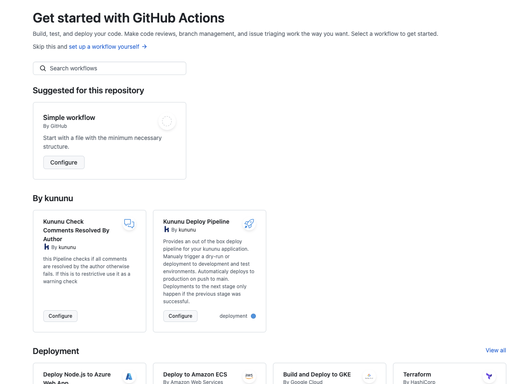

# .github
> **Warning**: for this repo to work properly, it needs to be public. Dont share any sensitive information in your workflow templates.

This repository contains workflow templates and GitHub Actions to be reused in other repositories.
Workflows in the templates folder will be searchable in the GitHub UI when creating a new workflow. This is the only [special repository](https://docs.github.com/en/actions/sharing-automations/creating-workflow-templates-for-your-organization) that can do this.

## Repository Structure
- **workflow-templates/**:  Workflow Templates to be searchable in the GitHub UI when creating a new workflow. Ideally they are based on reusable workflows and actions in the [shared-github-workflows](https://github.com/kununu/shared-github-workflows) repo only, but that is not a strict requirement.

## Usage
- [Use workflow templates](https://docs.github.com/en/actions/writing-workflows/using-workflow-templates)

## contribute
- [create reusable workflows](https://docs.github.com/en/actions/sharing-automations/reusing-workflows#creating-a-reusable-workflow)
